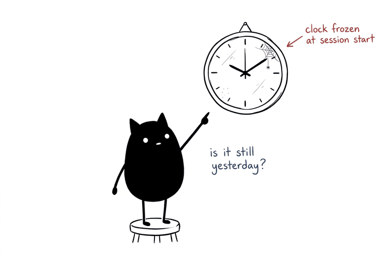
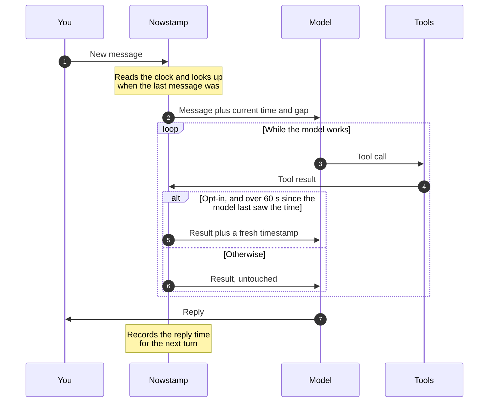

<h1 align="center">Hermes Nowstamp</h1>

<p align="center">
  <b>Give your Hermes agent a clock.</b><br>
  A <a href="https://hermes-agent.nousresearch.com">Hermes Agent</a> plugin that tells the model the current date and time,<br>
  and how long ago the previous message was, on every single turn.
</p>

<p align="center">
  <a href="https://github.com/zakiyys/hermes-nowstamp/tags"></a>
  
  <a href="https://hermes-agent.nousresearch.com"></a>
  
  
  
  
  
  
  
  
  
</p>

<p align="center">
  
</p>

<p align="center">
  <a href="#quick-start">Quick start</a> ·
  <a href="#let-your-agent-install-it">Let your agent install it</a> ·
  <a href="#how-it-works">How it works</a> ·
  <a href="#settings">Settings</a> ·
  <a href="#limitations">Limitations</a>
</p>

---

## The problem

You reply to your agent five minutes later, and it says *"as we discussed yesterday"*.

It is not being careless. It has no way to know:

- **The system prompt timestamp is frozen.** Hermes writes it once when a session starts, then caches it. In a long-lived gateway session (Telegram, Discord, ...) that time can be hours or days stale.
- **Old messages carry no send time.** Nothing in the history says when each message arrived, so the model guesses the gap. That guess is where "yesterday" and "last night" come from.
- **Long tool loops drift.** A turn that runs tools for several minutes has no fresh clock in the middle.

| | Without Nowstamp | With Nowstamp |
|---|---|---|
| **You, 19:37** | ok, deploy it | ok, deploy it |
| **You, 19:42** | did it work? | did it work? |
| **Agent** | Yes, the deploy I ran *last night* finished cleanly. | Yes, the deploy from *five minutes ago* finished cleanly. |

## What the model sees

One line, appended to your message on every turn:

```
[Current time: Tue 2026-10-06 19:42 WITA (UTC+0800) | previous message: 5 min ago (today 19:37)]
```

- **Current time** is read fresh from the host clock, in your timezone, with the weekday and UTC offset.
- **Previous message** is the real gap since the last message in that conversation: the moment the agent finished replying, or the previous user message if no reply was recorded. It is left out on the first message of a session.
- **`today` / `yesterday`** follow the calendar date in your timezone, not the number of hours. A message from 23:50 is "yesterday" at 00:10.

The system prompt is never touched, so your prompt cache stays intact.

## Quick start

```bash
hermes plugins install zakiyys/hermes-nowstamp
hermes plugins enable nowstamp
```

Then start a new session and ask:

> What day and time is it? Do not use any tools.

If the answer matches your clock, you are done. If the agent cannot tell, restart the gateway (`hermes gateway restart`) or start a new CLI session, and ask again. Depending on your Hermes version, a running gateway either picks up new hooks right away or needs that restart.

No timezone configured in Hermes yet? See [Timezone](#timezone).

## Let your agent install it

Your agent can do the whole install for you. Paste this to it:

```
Install the nowstamp plugin for Hermes Agent.
Read https://raw.githubusercontent.com/zakiyys/hermes-nowstamp/main/README.md
and follow the section "Instructions for AI agents" step by step.
Stop and ask me at every step marked ASK.
```

### Instructions for AI agents

You are installing this plugin on behalf of a human. Follow the steps in order. Do not skip the checks.

**Ground rules**

- Only run the commands listed here, and only edit `config.yaml` in step 4.
- Never restart the gateway yourself. If you are running inside it, the restart kills your own turn. The human does it.
- Do not edit the system prompt, `SOUL.md`, memory files, or any other plugin.
- If a step fails or the output is not what is described, stop and report the exact output. Do not improvise a fix.

**Step 1. Pre-flight**

```bash
hermes plugins list
date
```

- If `nowstamp` is already listed and enabled, skip to step 6.
- Note whether any other installed plugin uses the `transform_tool_result` hook. You need this in step 4.
- Compare `date` with what the human expects. This plugin reports the host clock, so if the host clock is wrong, tell the human now.

**Step 2. Read before you run**

The plugin is one Python file with no dependencies and no network calls. Read `__init__.py` in this repository and tell the human in two or three sentences what it does before installing.

**Step 3. Install**

```bash
hermes plugins install zakiyys/hermes-nowstamp
hermes plugins doctor nowstamp
hermes plugins enable nowstamp
hermes plugins list
```

- `doctor` must report no errors. If it reports an unknown hook name, this Hermes version is too old for the plugin. Disable it, stop, and report the Hermes version.
- `nowstamp` must show as enabled in the final list.

**Step 4. Configure (ASK)**

Defaults work without any configuration. Only two things are worth asking the human about:

1. **Timezone.** If Hermes has no timezone set (no `HERMES_TIMEZONE` env var and no top-level `timezone:` in `config.yaml`), the plugin shows the server's local time. ASK the human which IANA timezone they want, for example `Asia/Makassar`.
2. **Tool-result stamping.** Off by default. ASK whether they want it. Recommend it only for long-running agent tasks, and only if step 1 found no other plugin using `transform_tool_result`.

If anything needs to change, back up first, then edit only these keys:

```bash
cp ~/.hermes/config.yaml ~/.hermes/config.yaml.bak-nowstamp
```

```yaml
timezone: Asia/Makassar        # top level, only if the human asked for it

plugins:
  entries:
    nowstamp:
      settings:
        stamp_tool_results: true   # only if the human asked for it
```

Use the path of the active profile if it is not `~/.hermes/`. Keep every other key in the file exactly as it was.

**Step 5. Activate (ASK)**

Settings are read when the plugin loads. ASK the human to run `hermes gateway restart`, or to start a new CLI session. Tell them you will verify in your next turn.

**Step 6. Verify**

In a new turn after activation, look at the end of the user message. You should see a line like:

```
[Current time: Tue 2026-10-06 19:42 WITA (UTC+0800)]
```

Tell the human the weekday, date, and time from that line, without calling any tool, and ask them to confirm it matches their clock.

If the line is missing:

```bash
hermes plugins list
hermes logs --level WARNING | grep -i plugin
```

Report what you find. Do not guess the time.

**Step 7. Report**

Tell the human: that the plugin is installed and enabled, which settings you changed, where the config backup is, and anything that still needs their action.

**Rollback**

```bash
hermes plugins disable nowstamp
```

If you changed any settings in step 4, tell the human which keys you added and where the backup from step 4 is, so they can put the original values back themselves.

## How it works



Three hooks, all fail-safe. A hook never raises: on any error it returns `None` and the turn continues as if the plugin were not there.

| Hook | When | Job |
|------|------|-----|
| `pre_llm_call` | Once per turn | Builds the time line and appends it to the user message. Also records this message's time. |
| `post_llm_call` | After the agent replies | Records the reply time, so the next turn measures the gap from the end of the last reply. |
| `transform_tool_result` | After a tool finishes, opt-in | Stamps the current time onto the result if the agent has not been given the time for `stamp_interval_seconds`. |

Last-message times are stored per session through `ctx.state`, so they survive restarts, and are capped at the 200 most recent sessions. Nothing leaves your machine: the plugin makes no network calls and stores only session IDs and timestamps.

### Why not just a time tool?

A tool only helps when the model decides to call it, and models rarely do. They assume. Nowstamp puts the clock in front of the model on every turn, so there is nothing to remember to check.

## Timezone

Nowstamp follows Hermes, in this order:

1. The plugin `timezone` setting below (per-plugin override).
2. Env `HERMES_TIMEZONE`.
3. Top-level `timezone:` in `config.yaml`, for example `timezone: Asia/Makassar`.
4. The server's local time.

The time source is always the host's system clock. The timezone only changes how it is displayed.

## Settings

Set them under `plugins.entries.nowstamp.settings` in `config.yaml`. Settings are read when the plugin loads, so restart the gateway (or start a new session) after changing them.

| Setting | Default | Meaning |
|---------|---------|---------|
| `timezone` | `""` | IANA timezone override, e.g. `Asia/Makassar`. Empty follows the Hermes timezone. |
| `format` | `%a %Y-%m-%d %H:%M %Z (UTC%z)` | `strftime` format of the timestamp. |
| `language` | `en` | Day name language: `en` or `id`. |
| `show_elapsed` | `true` | Add the `previous message: ...` part. Turning it off also skips the `post_llm_call` hook. |
| `stamp_tool_results` | `false` | Also stamp tool results during long turns. |
| `stamp_interval_seconds` | `60` | Minimum seconds between tool-result stamps. `0` stamps every tool result. |

Example:

```yaml
plugins:
  entries:
    nowstamp:
      settings:
        language: id
        stamp_tool_results: true
        stamp_interval_seconds: 60
```

## Tool-result stamping

For long agent runs you can also keep the clock fresh in the middle of a turn. With `stamp_tool_results: true`, a tool result gets a timestamp when the model has not seen the time for a while. JSON results stay valid JSON:

```json
{"ok": true, "_current_time": "Tue 2026-10-06 19:44 WITA (UTC+0800)"}
```

Non-JSON results get a trailing line: `[Current time: ...]`.

It is spaced out, not applied to every result:

- A result is stamped only if more than `stamp_interval_seconds` have passed since the agent was last given the time in that session.
- The time line in your message counts as "given the time". In a short turn, tool results are not touched at all.
- In a long turn you get at most one stamp per interval, even if 50 tools run back to back.

**Why it is off by default.** `transform_tool_result` is a first-string-wins hook: if two plugins both return a string for the same result, Hermes uses the first one and drops the other. To avoid colliding with other plugins, the hook is only registered when you turn the setting on.

## Optional: lines for your system prompt

The time line is self-explanatory and most models use it correctly on their own. If yours still picks the wrong time words, add these to your system prompt or `SOUL.md`:

```
- Time: the `[Current time: ...]` line in the user message and the `_current_time` field in tool results are the correct clock. Use the latest one. Ignore older timestamps.
- Conversation gap: the `previous message: ...` part of that line is the real gap since the last message. Choose time words based on it. Do not say "yesterday", "last night", "this morning" and the like unless they match the gap and date on that line. If the gap is minutes or hours on the same day, say "earlier" or "just now".
- Date math (day differences, "in N days", which weekday): use `date -d` or Python, do not compute in your head.
```

## Cost

About 40 tokens per turn. With `stamp_tool_results` on, add about 30 tokens per stamp, at most one per interval.

## Limitations

- The clock updates once per turn and, if enabled, at most once per interval inside tool results. It is not continuous.
- The source is the host system clock. If the host clock is wrong, the result is wrong too, and the model will trust it.
- The gap info is missing for one turn when the session ID changes (a new session, or compression that rotates the session).
- With `stamp_tool_results` on, if another plugin also uses `transform_tool_result`, Hermes uses only one of them.
- If the plugin breaks after a Hermes update, it fails silently: the agent keeps working, just without the time line. Re-run the check from [Quick start](#quick-start) after upgrading Hermes.
- Knowing the time does not make the model good at date arithmetic. For date calculations, use a tool.
- `hermes_time` is an internal Hermes module, not part of the plugin contract. Nowstamp imports it defensively and falls back to the server's local time. Set the plugin's own `timezone` if you want to be independent of it.

## Uninstall

```bash
hermes plugins disable nowstamp
hermes plugins remove nowstamp
```

## Roadmap

- Move tool-result stamping from `transform_tool_result` to the `tool_execution` middleware. Middleware is chained (each plugin passes the result to the next), so there is no first-string-wins rule and plugin collisions go away. The shape of the result returned by `next_call` needs to be verified on the targeted Hermes version first.

## License

MIT. See [LICENSE](LICENSE).

<p align="center"><sub>Built by a Hermes agent, with its human.</sub></p>
